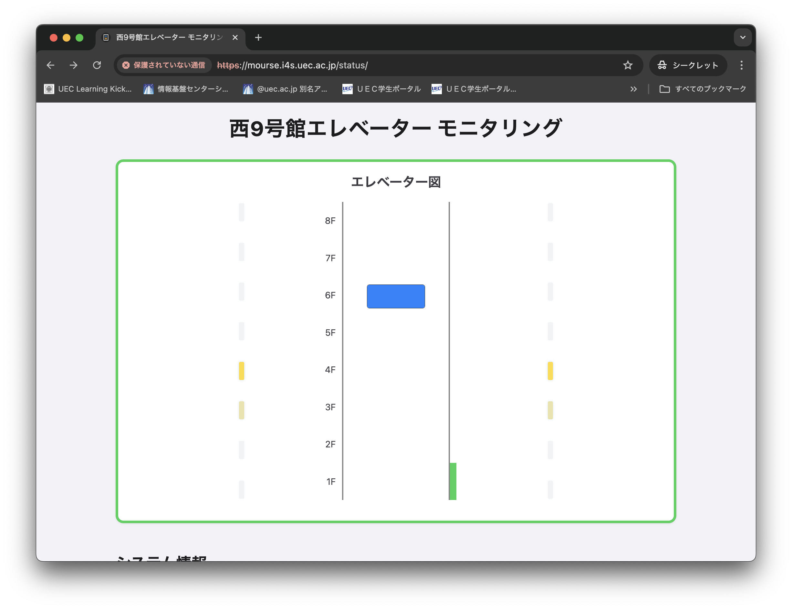

# 建物エレベーター モニタリング

このプロジェクトは、建物内のエレベーターの状態をWebブラウザ上で可視化・モニタリングするためのシンプルなWebアプリケーションです。



## 機能概要

- エレベーターの現在階、ドア状態、移動方向などをリアルタイムで表示
- GPIOや温度などのシステム情報も可視化
- テストモード（URLに`?test`を付与）でモックデータによる動作確認が可能

## セットアップ方法

1. **APIエンドポイントURLの設定**

   `script.js` の冒頭にある下記の部分を編集し、ご自身のAPIエンドポイントURLを設定してください。

   ```js
   /**
    * APIエンドポイントURLをここに入力してください
    * 例: 'https://example.com/api/endpoint'（この例はAkitoshi Saekiの環境を参考にしています）
    */
   const URL = 'ここにAPIエンドポイントURLを入力してください';
   ```

2. **ファイルをWebサーバー上に配置**

   本プロジェクトのファイル（`index.html`, `script.js`, `style.css` など）をWebサーバー上に配置してください。

3. **ブラウザでアクセス**

   `index.html` をブラウザで開くと、エレベーターの状態が表示されます。

## テストモード

- `index.html?test` のようにURL末尾に `?test` を付与すると、APIに接続せずモックデータで動作確認ができます。

## 注意事項

- このリポジトリには秘匿情報や特定の建物名などの固有名詞は含めないようにしてください。
- APIエンドポイントURLはご自身の環境に合わせて必ず編集してください。

## ライセンス

本プロジェクトはMITライセンスです。

---
